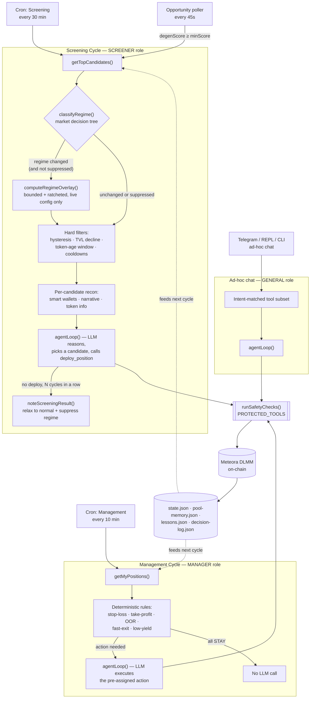
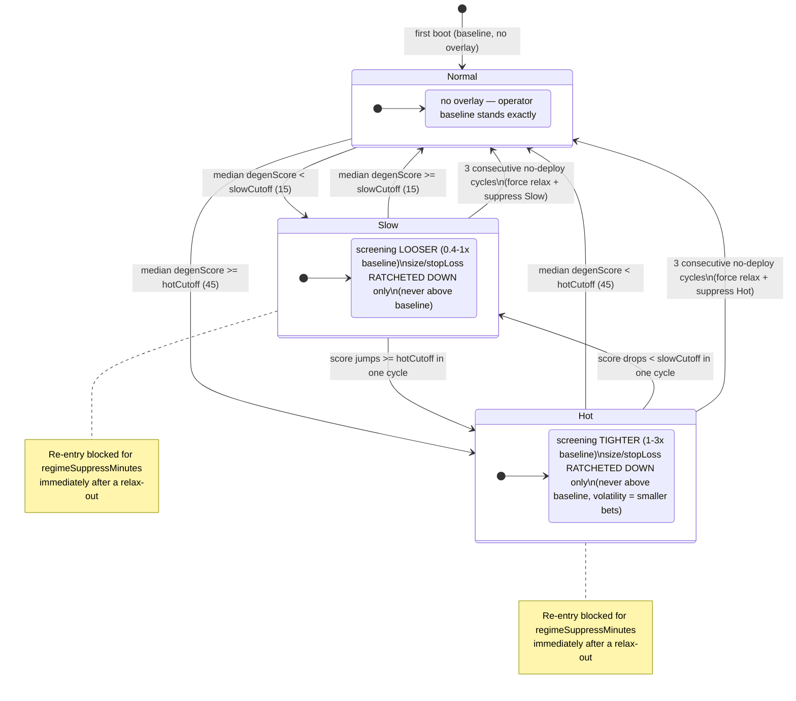
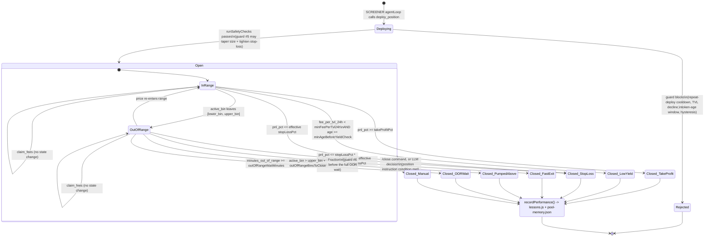

# Meridian

**Autonomous Meteora DLMM liquidity management agent for Solana, powered by LLMs.**

**Links:** [Website](https://agentmeridian.xyz) | [Telegram](https://t.me/agentmeridian) | [X](https://x.com/meridian_agent)

Meridian runs continuous screening and management cycles, deploying capital into high-quality Meteora DLMM pools and closing positions based on live PnL, yield, and range data. It learns from every position it closes.

---

## Changelog

Moved to [CHANGELOG.md](CHANGELOG.md) — full history from the original fork
onward.

---

## What it does

- **Screens pools** — scans Meteora DLMM pools against configurable thresholds (fee/TVL ratio, organic score, holder count, mcap, bin step) and surfaces high-quality opportunities
- **Manages positions** — monitors, claims fees, and closes LP positions autonomously; decides to STAY, CLOSE, or REDEPLOY based on live data
- **Learns from performance** — studies top LPers in target pools, saves structured lessons, and evolves screening thresholds based on closed position history
- **Discord signals** — optional Discord listener watches LP Army channels for Solana token calls and queues them for screening
- **Telegram chat** — full agent chat via Telegram, plus cycle reports and OOR alerts
- **Claude Code integration** — run AI-powered screening and management directly from your terminal using Claude Code slash commands

---

## How it works

Meridian runs a **ReAct agent loop** — each cycle the LLM reasons over live data, calls tools, and acts. Two specialized agents run on independent cron schedules:

| Agent | Default interval | Role |
|---|---|---|
| **Screening Agent** | Every 30 min | Pool screening — finds and deploys into the best candidate |
| **Management Agent** | Every 10 min | Position management — evaluates each open position and acts |

### Agent harness

Meridian's agent harness is the runtime wrapper around every autonomous cycle. It gives both **main** and **experimental** agents the same control loop: load live state, inject relevant memory, expose only role-appropriate tools, execute tool calls, and return a readable cycle report.

The harness also keeps a structured decision log in `decision-log.json` for deployments, closes, skips, and no-deploy outcomes. Each entry records the actor, pool or position, summary, reason, key risks, metrics, and rejected alternatives. Recent decisions are injected back into the system prompt and are available through `get_recent_decisions`, so the agent can answer "why did you deploy?", "why did you close?", or "why did you skip?" without guessing after the fact.

**Data sources:**
- `@meteora-ag/dlmm` SDK — on-chain position data, active bin, deploy/close transactions
- Meteora DLMM PnL API — position yield, fee accrual, PnL
- Pool screening API — fee/TVL ratios, volume, organic scores, holder counts
- Jupiter API — token audit, mcap, launchpad, price stats

Agents are powered via **OpenRouter** and can be swapped for any compatible model.

---

## Requirements

- Node.js 18+
- [OpenRouter](https://openrouter.ai) API key
- Solana wallet (base58 private key)
- Solana RPC endpoint ([Helius](https://helius.xyz) recommended)
- Telegram bot token (optional)
- [Claude Code](https://claude.ai/code) CLI (optional, for terminal slash commands)

---

## Setup

### 1. Clone & install

```bash
git clone https://github.com/yunus-0x/meridian
cd meridian
npm install
```

### 2. Run the setup wizard

```bash
npm run setup
```

The wizard writes **both** files at the repo root:

| Goes in `.env` | Goes in `user-config.json` |
|---|---|
| `WALLET_PRIVATE_KEY`, `OPENROUTER_API_KEY`, `RPC_URL`, `HELIUS_API_KEY` | Risk preset, deploy size, max positions |
| `TELEGRAM_BOT_TOKEN`, `TELEGRAM_CHAT_ID`, `TELEGRAM_ALLOWED_USER_IDS` | Strategy, screening filters, exit rules, trailing TP |
| `DRY_RUN` | Position sizing, cycle intervals, per-role LLM models, `solMode` |

`TELEGRAM_CHAT_ID` only needs to live in `.env` — setup also copies it to `user-config.json` when provided. Takes about 2 minutes.

**Or set up manually:**

Create `.env`:

```env
WALLET_PRIVATE_KEY=your_base58_private_key
RPC_URL=https://mainnet.helius-rpc.com/?api-key=YOUR_KEY
OPENROUTER_API_KEY=sk-or-...
HELIUS_API_KEY=your_helius_key          # for wallet balance lookups
TELEGRAM_BOT_TOKEN=123456:ABC...        # optional — for notifications + chat
TELEGRAM_CHAT_ID=                       # auto-filled on first message
DRY_RUN=true                            # set false for live trading
```

> Never put your private key or API keys in `user-config.json` — use `.env` only. Both files are gitignored.

Optional encrypted `.env` flow:

```bash
cp .env .env.raw
printf "replace-with-a-long-local-key\n" > .envrypt
npm run env:encrypt
```

Meridian loads envrypt-style encrypted values automatically. Keep `.env.raw` and `.envrypt` local; both are gitignored.

Copy config and edit as needed:

```bash
cp user-config.example.json user-config.json
```

See [Config reference](#config-reference) below.

### 3. Run

```bash
npm run dev    # dry run — no on-chain transactions
npm start      # live mode
```

On startup Meridian fetches your wallet balance, open positions, and top pool candidates, then begins autonomous cycles immediately.

### Run with PM2 (VPS / always-on)

PM2 is the recommended way to keep Telegram control online on a VPS. **Always start via the ecosystem file** so the working directory and script path stay pinned to the repo:

```bash
npm install
npm run pm2:start    # uses ecosystem.config.cjs — do NOT use "pm2 start index.js"
pm2 save
```

After `.env`, `user-config.json`, or code changes:

```bash
npm run pm2:restart  # re-reads .env on each restart
npm run pm2:logs
```

To update an existing PM2 install:

```bash
npm run pm2:down    # stop + delete the running instance first — safe to pull
git pull
npm install
npm run pm2:start
pm2 save
```

`npm run pm2:down` runs `pm2 stop meridian` then `pm2 delete meridian`, both
no-op-safe (`|| true`) if PM2 isn't installed or nothing is running — so it's
always safe to run before a `git pull`, even on a fresh checkout. Stopping
the old instance first avoids pulling code out from under a running process
(stale `.js` files mid-import, a partially-written file mid-cron-tick) and
guarantees the next `pm2:start` picks up the new code cleanly rather than
`pm2:restart`-ing a process still holding the old build in memory.

`pm2:stop` and `pm2:delete` are also available individually if you want to
stop without removing PM2's process entry, or vice versa.

**PM2 vs `npm start`**

| | `npm start` | PM2 |
|---|---|---|
| Terminal | Interactive REPL | Headless daemon |
| Cron / Telegram | Starts after REPL banner | Starts immediately on boot |
| First screening | On cron schedule | May run one cycle right at startup |
| Best for | Local dev / testing | VPS / 24-7 operation |

On startup, logs show `Repo: ... | cwd: ... | PM2 id: ...`. **Repo and cwd must match.** If they differ, delete the process and use `npm run pm2:start` again.

**Common PM2 issues**

| Symptom | Likely cause | Fix |
|---|---|---|
| Crash loop after `git pull` | `npm install` skipped | `npm install && npm run pm2:restart` |
| Missing wallet / API keys | Started with `pm2 start index.js` from wrong directory | `pm2 delete meridian && npm run pm2:start` |
| `.env` changes ignored | Old PM2 env snapshot | `npm run pm2:restart` (`.env` now overrides stale PM2 env) |
| Telegram `401 Unauthorized` | Invalid `TELEGRAM_BOT_TOKEN` (not chat ID) | Fix token in `.env`; if encrypted, ensure `.envrypt` exists |
| Telegram commands ignored | Missing/wrong `TELEGRAM_CHAT_ID` | Set in `.env` (or `telegramChatId` in `user-config.json`) |
| Duplicate polling / 409 errors | `nohup node index.js` or second PM2 instance running | Kill stray processes; run only one PM2 app |
| Encrypted env crash at boot | `# encrypted` lines without `.envrypt` key | Add `.envrypt` or use plain `.env` values |

Avoid `nohup node index.js` — it runs outside PM2 and can leave a duplicate Telegram poller fighting the managed process.

---

## Running modes

### Autonomous agent

```bash
npm start
```

Starts the full autonomous agent with cron-based screening + management cycles and an interactive REPL. The prompt shows a live countdown to the next cycle:

```
[manage: 8m 12s | screen: 24m 3s]
>
```

REPL commands:

| Command | Description |
|---|---|
| `/status` | Wallet balance and open positions |
| `/candidates` | Re-screen and display top pool candidates |
| `/learn` | Study top LPers across all current candidate pools |
| `/learn <pool_address>` | Study top LPers for a specific pool |
| `/thresholds` | Current screening thresholds and performance stats |
| `/evolve` | Trigger threshold evolution from performance data (needs 5+ closed positions) |
| `/stop` | Graceful shutdown |
| `<anything>` | Free-form chat — ask the agent anything, request actions, analyze pools |

---

### Claude Code terminal (recommended)

Install [Claude Code](https://claude.ai/code) and use it from inside the meridian directory. Claude Code has built-in agents and slash commands that use the `meridian` CLI under the hood.

```bash
cd meridian
claude
```

#### Slash commands

| Command | What it does |
|---|---|
| `/screen` | Full AI screening cycle — checks Discord queue, reads config, fetches candidates, runs deep research, and deploys if a winner is found |
| `/manage` | Full AI management cycle — checks all positions, evaluates PnL, claims fees, closes OOR/losing positions |
| `/balance` | Check wallet SOL and token balances |
| `/positions` | List all open DLMM positions with range status |
| `/candidates` | Fetch and enrich top pool candidates (pool metrics + token audit + smart money) |
| `/study-pool` | Study top LPers on a specific pool |
| `/pool-ohlcv` | Fetch price/volume history for a pool |
| `/pool-compare` | Compare all Meteora DLMM pools for a token pair by APR, fee/TVL ratio, and volume |

#### Claude Code agents

Two specialized sub-agents run inside Claude Code:

**`screener`** — pool screening specialist. Invoke when you want to evaluate candidates, analyse token risk, or deploy a position. Has access to Jupiter token audit, smart-wallet checks, and all strategy logic.

**`manager`** — position management specialist. Invoke when reviewing open positions, assessing PnL, claiming fees, or closing positions.

To trigger an agent directly, just describe what you want:
```
> screen for new pools and deploy if you find something good
> review all my positions and close anything out of range
> what do you think of the SOL/BONK pool?
```

#### Loop mode

Run screening or management on a timer inside Claude Code:

```
/loop 30m /screen     # screen every 30 minutes
/loop 10m /manage     # manage every 10 minutes
```

---

### CLI (direct tool invocation)

The `meridian` CLI gives you direct access to every tool with JSON output — useful for scripting, debugging, or piping into other tools.

```bash
npm install -g .   # install globally (once)
meridian <command> [flags]
```

Or run without installing:

```bash
node cli.js <command> [flags]
```

**Positions & PnL**

```bash
meridian positions
meridian pnl <position_address>
meridian wallet-positions --wallet <addr>
```

**Screening**

```bash
meridian candidates --limit 5
meridian pool-detail --pool <addr> [--timeframe 5m]
meridian active-bin --pool <addr>
meridian search-pools --query <name_or_symbol>
meridian study --pool <addr> [--limit 4]
```

**Token research**

```bash
meridian token-info --query <mint_or_symbol>
meridian token-holders --mint <addr> [--limit 20]
meridian token-narrative --mint <addr>
```

**Deploy & manage**

```bash
meridian deploy --pool <addr> --amount <sol> [--bins-below 69] [--bins-above 0] [--strategy bid_ask|spot|curve] [--dry-run]
meridian claim --position <addr>
meridian close --position <addr> [--skip-swap] [--dry-run]
meridian swap --from <mint> --to <mint> --amount <n> [--dry-run]
meridian add-liquidity --position <addr> --pool <addr> [--amount-x <n>] [--amount-y <n>] [--strategy spot]
meridian withdraw-liquidity --position <addr> --pool <addr> [--bps 10000]
```

**Agent cycles**

```bash
meridian screen [--dry-run] [--silent]   # one AI screening cycle
meridian manage [--dry-run] [--silent]   # one AI management cycle
meridian start [--dry-run]               # start autonomous agent with cron jobs
```

**Config**

```bash
meridian config get
meridian config set <key> <value>
```

**Learning & memory**

```bash
meridian lessons
meridian lessons add "your lesson text"
meridian performance [--limit 200]
meridian evolve
meridian pool-memory --pool <addr>
```

**Blacklist**

```bash
meridian blacklist list
meridian blacklist add --mint <addr> --reason "reason"
```

**Discord signals**

```bash
meridian discord-signals
meridian discord-signals clear
```

**Balance**

```bash
meridian balance
```

**Flags**

| Flag | Effect |
|---|---|
| `--dry-run` | Skip all on-chain transactions |
| `--silent` | Suppress Telegram notifications for this run |

---

## Discord listener

The Discord listener watches configured channels (e.g. LP Army) for Solana token calls and queues them as signals for the screener agent.

### Setup

```bash
cd discord-listener
npm install
```

Add to your root `.env`:

```env
DISCORD_USER_TOKEN=your_discord_account_token   # from browser DevTools → Network
DISCORD_GUILD_ID=the_server_id
DISCORD_CHANNEL_IDS=channel1,channel2            # comma-separated
DISCORD_MIN_FEES_SOL=5                           # minimum pool fees to pass pre-check
```

> This uses a selfbot (personal account automation, not a bot token). Use responsibly.

### Run

```bash
cd discord-listener
npm start
```

Or run it in a separate terminal alongside the main agent. Signals are written to `discord-signals.json` and picked up automatically by `/screen` and `node cli.js screen`.

### Signal pipeline

Each incoming token address passes through a pre-check pipeline before being queued:
1. **Dedup** — ignores addresses seen in the last 10 minutes
2. **Blacklist** — rejects blacklisted token mints
3. **Pool resolution** — resolves the address to a Meteora DLMM pool
4. **Rug check** — checks deployer against `deployer-blacklist.json`
5. **Fees check** — rejects pools below `DISCORD_MIN_FEES_SOL`

Signals that pass all checks are queued with status `pending`. The screener picks up pending signals and processes them as priority candidates before running the normal screening cycle.

### Deployer blacklist

Add known rug/farm deployer wallet addresses to `deployer-blacklist.json`:

```json
{
  "_note": "Known farm/rug deployers — add addresses to auto-reject their pools",
  "addresses": [
    "WaLLeTaDDressHere"
  ]
}
```

---

## Telegram

### Setup

1. Create a bot via [@BotFather](https://t.me/BotFather) and copy the token
2. Add to `.env`:

```env
TELEGRAM_BOT_TOKEN=<token>
TELEGRAM_CHAT_ID=<your chat id>          # .env alone is enough; also saved to user-config by setup
TELEGRAM_ALLOWED_USER_IDS=<user id>    # required for group/supergroup control
```

Meridian does **not** auto-register the first chat for safety — you must set `TELEGRAM_CHAT_ID` explicitly. For groups, also set `TELEGRAM_ALLOWED_USER_IDS` or inbound commands are ignored.

`401 Unauthorized` in logs means a bad `TELEGRAM_BOT_TOKEN` (invalid, revoked, or encrypted without a working `.envrypt` key) — not a chat ID problem.

### Notifications

Meridian sends notifications automatically for:
- Management cycle reports (reasoning + decisions)
- Screening cycle reports (what it found, whether it deployed)
- OOR alerts when a position leaves range past `outOfRangeWaitMinutes`
- Deploy: pair, amount, position address, tx hash
- Close: pair and PnL
- Regime changes: which config keys shifted and by how much, explicitly
  labeled **in-memory only** so it's never mistaken for an edit to your saved
  `user-config.json`/Supabase baseline

All structured notifications (deploy/close/swap/config-change/OOR/regime) and
the live Screening/Management Cycle messages render as HTML — aligned
`<pre>` label/value tables via a shared `htmlTable()` helper, with every
dynamic value escaped so a stray `<`/`&` in a pool name or LLM-authored report
can never break the message.

### Telegram commands

| Command | Action |
|---|---|
| `/positions` | List open positions with progress bar |
| `/close <n>` | Close position by list index |
| `/set <n> <note>` | Set a note on a position |

You can also chat freely via Telegram using the same interface as the REPL. Only allowed user IDs can issue commands in groups.

---

## Config reference

All fields are optional — defaults shown. Edit `user-config.json`.

### Screening

| Field | Default | Description |
|---|---|---|
| `minFeeActiveTvlRatio` | `0.05` | Minimum fee/active-TVL ratio |
| `minTvl` | `10000` | Minimum pool TVL (USD) |
| `maxTvl` | `150000` | Maximum pool TVL (USD) |
| `minVolume` | `500` | Minimum pool volume |
| `minOrganic` | `60` | Minimum organic score (0–100) |
| `minHolders` | `500` | Minimum token holder count |
| `minMcap` | `150000` | Minimum market cap (USD) |
| `maxMcap` | `10000000` | Maximum market cap (USD) |
| `minBinStep` | `80` | Minimum bin step |
| `maxBinStep` | `125` | Maximum bin step |
| `timeframe` | `5m` | Candle timeframe for screening |
| `category` | `trending` | Pool category filter |
| `minTokenFeesSol` | `30` | Minimum all-time fees in SOL |
| `maxBotHoldersPct` | `30` | Maximum bot holder % (Jupiter audit) |
| `maxTop10Pct` | `60` | Maximum top-10 holder concentration |
| `blockedLaunchpads` | `[]` | Launchpad names to never deploy into |

### Management

| Field | Default | Description |
|---|---|---|
| `deployAmountSol` | `0.5` | Base SOL per new position |
| `positionSizePct` | `0.35` | Fraction of deployable balance to use |
| `maxDeployAmount` | `50` | Maximum SOL cap per position |
| `gasReserve` | `0.2` | Minimum SOL to keep for gas |
| `minSolToOpen` | `0.55` | Minimum wallet SOL before opening |
| `outOfRangeWaitMinutes` | `30` | Minutes OOR before acting |
| `stopLossPct` | `-15` | Close position if price drops by this % |
| `takeProfitPct` | `5` | Close when fees earned reach this % of capital |
| `trailingTakeProfit` | `true` | Enable trailing take-profit |
| `trailingTriggerPct` | `3` | Activate trailing TP at this PnL % |
| `trailingDropPct` | `1.5` | Close when PnL drops this % from peak |
| `strategy` | `bid_ask` | LP strategy: `spot`, `bid_ask`, or `curve` |

### Market regime

See [Market regime state machine](#market-regime-state-machine) for how these
interact. `regimeSlowCutoff`/`regimeHotCutoff` gate `classifyRegime()`;
`regimeRelaxAfterFails`/`regimeSuppressMinutes` gate the relax/loopback-guard
fallback. None of these config keys, nor anything a regime does at runtime,
is ever written back to `user-config.json` or pushed to Supabase.

| Field | Default | Description |
|---|---|---|
| `regimeDetectionEnabled` | `true` | Master switch for regime detection + overlay |
| `regimeSlowCutoff` | `15` | Median degenScore below this → `slow` |
| `regimeHotCutoff` | `45` | Median degenScore at/above this → `hot` |
| `regimeRelaxAfterFails` | `3` | Consecutive no-deploy screening cycles before force-relaxing to `normal` |
| `regimeSuppressMinutes` | `120` | How long the regime just relaxed out of is blocked from being re-entered |

### Schedule

| Field | Default | Description |
|---|---|---|
| `managementIntervalMin` | `10` | Management cycle frequency (minutes) |
| `screeningIntervalMin` | `30` | Screening cycle frequency (minutes) |

### Models

| Field | Default | Description |
|---|---|---|
| `managementModel` | `openai/gpt-oss-20b:free` | LLM for management cycles |
| `screeningModel` | `openai/gpt-oss-20b:free` | LLM for screening cycles |
| `generalModel` | `openai/gpt-oss-20b:free` | LLM for REPL / chat |

> Override model at runtime: `node cli.js config set screeningModel anthropic/claude-opus-4-5`

### Jupiter swap fee (referral)

Every token swap the agent makes (auto-swap base→SOL after a close/claim, manual `swap_token`) goes through **Jupiter Ultra**. Jupiter's referral program lets a referral wallet collect a small fee, expressed in **basis points (bps)** — `1 bps = 0.01%`, so `50 bps = 0.5%`. Meridian ships with this enabled by default.

**Settings** (env only — *not* in `user-config.json`):

| Env var | Default | Description |
|---|---|---|
| `JUPITER_REFERRAL_ACCOUNT` | built-in account | A **Jupiter referral account** (not just any wallet). Create one on the Jupiter referral dashboard (`referral.jup.ag`) — it generates a referral account and the per-token fee accounts that actually collect the fee. Paste that referral account address here to collect the fee yourself. |
| `JUPITER_REFERRAL_FEE_BPS` | `50` | Fee in basis points. **Jupiter Ultra requires 50–255 bps** — values outside that range (or `0`) are ignored and the swap runs with no referral fee. |

```bash
# .env — collect the referral fee on your own Jupiter referral account
JUPITER_REFERRAL_ACCOUNT=<your-jupiter-referral-account>
JUPITER_REFERRAL_FEE_BPS=50
```

**To turn the referral off**, just remove/blank it — set `JUPITER_REFERRAL_ACCOUNT=` (empty) **or** `JUPITER_REFERRAL_FEE_BPS=0`. Either one drops the referral and the swap proceeds at Jupiter's normal rate. The referral is also silently dropped if the fee is below `50`, above `255`, or the account isn't a valid Solana address (`tools/wallet.js#getJupiterReferralParams`). **`50` is the minimum Jupiter allows and the Meridian default.**

> If you leave the referral enabled on the **built-in default account**, the fee goes toward **Meridian server maintenance** (HiveMind, Agent Meridian API, hosting). Override `JUPITER_REFERRAL_ACCOUNT` with your own Jupiter referral account to collect it yourself instead, or disable it entirely as above. Either way, on new tokens (<24h) it's the same 0.5% Jupiter charges regardless — so leaving the default on costs you nothing extra there.

> **Why 50 bps is effectively free on new tokens.** Jupiter's own platform fee already varies by pair — and for **new tokens (within 24h of token age) Jupiter charges 50 bps (0.5%)** on its UI regardless. So on those tokens the swap costs the same 0.5% **whether or not you attach a referral** — adding the referral just redirects that fee to your wallet instead of leaving it at Jupiter's default. (Jupiter's full platform-fee schedule: `0` bps buying Jupiter tokens / pegged LST-LST & stable-stable, `2` SOL-stable, `5` LST-stable, `10` everything else, `50` new tokens <24h.)

---

## How it learns

### Lessons

After every closed position the agent runs `studyTopLPers` on candidate pools, analyzes on-chain behavior of top performers (hold duration, entry/exit timing, win rates), and saves concrete lessons. Lessons are injected into subsequent agent cycles as part of the system context.

Add a lesson manually:
```bash
node cli.js lessons add "Never deploy into pump.fun tokens under 2h old"
```

### Threshold evolution

After 5+ positions have been closed, run:
```bash
node cli.js evolve
```

This analyzes closed position performance (win rate, avg PnL, fee yields) and automatically adjusts screening thresholds in `user-config.json`. Changes take effect immediately.

---

## HiveMind

HiveMind sync uses Agent Meridian at `https://api.agentmeridian.xyz` by default with the built-in public key. Agents can register, pull shared lessons/presets, and push learning events without a separate registration flow.

**What you get:**
- Shared lessons from other Meridian agents
- Strategy presets and crowd performance context
- Role-aware lessons injected into future screener/manager prompts when `hiveMindPullMode` is `auto`

**What you share:**
- Lessons from `lessons.json`
- Closed-position performance events: pool, pool name, base mint, strategy, close reason, PnL, fees, and hold time
- Agent heartbeat metadata: agent ID, version, timestamp, and basic capability flags
- **Private keys and wallet balances are never sent**

HiveMind failures are non-blocking. If Agent Meridian is unavailable, the agent logs a warning and keeps running.

### Setup

No manual HiveMind registration command is required for the shared Agent Meridian setup. `agentId` is generated automatically on startup if it is missing.

To use a private HiveMind API key, check the Telegram announcement channel and set it as `hiveMindApiKey`.

Relevant config fields:

```json
{
  "agentId": "",
  "hiveMindUrl": "",
  "hiveMindApiKey": "",
  "hiveMindPullMode": "auto"
}
```

Blank `hiveMindUrl` and `hiveMindApiKey` values intentionally fall back to the Agent Meridian defaults. Set `hiveMindPullMode` to `manual` if you do not want shared lessons and presets pulled automatically.

### Disable

There is currently no empty-string disable path for HiveMind; blank values fall back to the built-in Agent Meridian defaults. A true off switch should be implemented as an explicit config flag before documenting HiveMind as disabled by clearing fields.

---

## Supabase (optional remote config store)

`integrations/supabase-config.js` can sync `user-config.json` to/from a Supabase
key-value table. **The agent only ever pulls** — on startup and every 15
minutes (`startSupabaseConfigBackgroundSync`). Nothing the agent decides at
runtime (including regime overlay changes — see above) is ever pushed
upstream; Supabase is the operator's source of truth, not a shared scratchpad.

Publishing a new baseline is an explicit operator action:

```bash
node scripts/push-config.js         # dry-run: lists keys + flags secret-looking values
node scripts/push-config.js --yes   # actually pushes
```

Required env vars: `SUPABASE_URL`, `SUPABASE_SERVICE_ROLE_KEY`,
`SUPABASE_DB_SCHEMA`, `SUPABASE_DB_TABLENAME`. Note that `user-config.json`
contains `llmApiKey` and other secrets in plaintext — `push-config.js` warns
you which keys look secret-ish before it publishes, but the table itself is
not encrypted.

---

## Using a local model (LM Studio)

```env
LLM_BASE_URL=http://localhost:1234/v1
LLM_API_KEY=lm-studio
LLM_MODEL=your-local-model-name
```

Any OpenAI-compatible endpoint works.

---

## Architecture

### Process flow



### Market regime state machine

Re-evaluated once per screening cycle (30 min) against that cycle's candidate
set. On a transition, `computeRegimeOverlay()` derives a **bounded,
ratcheted** config delta from the operator's own baseline (`user-config.json`
/ Supabase) — never an absolute value, and applied to the **live in-memory
config only**. Screening bars move both ways inside relative clamps; risk
keys (`deployAmountSol`, `positionSizePct`, `stopLossPct`) can only ever move
toward *less* exposure than baseline, never more. `normal` is always an exact
no-op — the operator's baseline stands untouched.

A second, independent path exists purely to recover from a regime that
starved itself of the candidates it would need to reclassify: after
`regimeRelaxAfterFails` (default 3) consecutive no-deploy screening cycles,
the active regime force-relaxes to `normal` and is **suppressed** from being
re-entered for `regimeSuppressMinutes` (default 120) — without that
suppression, relax → re-detect the same regime → tighten → starve → relax
would repeat forever.



### Position lifecycle

Covers every path a position can take from deploy attempt to close — the
same deterministic rules from `getDeterministicCloseRule()` plus the 7 guards
added this session. Claiming fees is a side-action, not a state transition
(a position can claim any number of times while `Open`).



### Regime change ↔ open positions

How a regime flip touches both the *next* deploy and *already-open*
positions in the same pass — there is no per-position snapshotting, so a
downshift (e.g. Hot → Slow) retroactively tightens exit rules on positions
opened under the old regime. Note the config mutation is live-config-only:
nothing here touches `user-config.json` or Supabase.

```mermaid
sequenceDiagram
    participant SC as Screening Cron (30m)
    participant Run as runScreeningCycle
    participant Reg as classifyRegime + regime library
    participant Ov as regime-overlay.js
    participant MC as Management Cron (10m)
    participant Pos as Open Positions

    SC->>Run: trigger
    Run->>Run: getTopCandidates()
    Run->>Reg: classifyRegime(candidates)
    alt regime changed, not suppressed, e.g. Normal to Hot
        Run->>Reg: isRegimeSuppressed("hot")?
        Reg-->>Run: false — proceed
        Run->>Ov: readBaseline() + computeRegimeOverlay("hot", baseline)
        Ov-->>Run: bounded, ratcheted delta (deploy size/stopLoss never above baseline)
        Run->>Run: applyOverlayToLiveConfig() — config.* mutated IN MEMORY ONLY
        Run-->>Run: decision-log "regime_change" + Telegram notice ("in-memory only")
        Note over Run: deployAmount/strategy recomputed AFTER<br/>this point — same-cycle effect
        Run->>Run: deploy using Hot overlay's size/thresholds
    else regime changed but suppressed
        Run->>Run: stay on current regime, log suppression
    else regime unchanged
        Run->>Run: deploy using current regime's overlay
    end

    opt 3 consecutive no-deploy cycles
        Run->>Reg: noteRegimeRelax(activeRegime, suppressMinutes)
        Reg-->>Run: activeRegime suppressed; fail counter reset
        Run->>Ov: computeRegimeOverlay("normal", baseline) — empty overlay
        Run->>Run: live config reverts to operator baseline
    end

    MC->>Pos: getMyPositions() (independent 10m cadence)
    Pos->>Pos: read config.management.stopLossPct/<br/>takeProfitPct fresh, every tick
    Note over Pos: Retroactive — a position opened under the<br/>OLD regime is now evaluated against the<br/>NEW regime's exit rules. A restart or a<br/>Supabase pull restores the operator's baseline.
```

### File map

```
index.js            Main entry: REPL + cron orchestration + Telegram bot polling
cli.js               Direct CLI — every tool as a subcommand with JSON output
setup.js             Interactive first-run wizard
repo-root.js         Stable absolute repo path — used by PM2, state files, and .env loading
logger.js            Shared logger — near-universal dependency, stays at root

core/
  agent.js            ReAct loop: LLM → tool call → repeat
  config.js           Runtime config from user-config.json + .env (repo-root paths)
  prompt.js           System prompt builder (SCREENER / MANAGER / GENERAL roles)
  screening-scales.js Timeframe-scaled screening defaults

state/
  state.js            Position registry (state.json)
  decision-log.js     Structured decision log for deploy, close, skip, and no-deploy rationale
  lessons.js          Learning engine: records performance, derives lessons, evolves thresholds
  pool-memory.js      Per-pool deploy history + snapshots
  strategy-library.js Saved LP strategies
  smart-wallets.js    KOL/alpha wallet tracker
  token-blacklist.js  Permanent token blacklist
  dev-blocklist.js    Deployer wallet blocklist
  signal-tracker.js   In-memory screening-signal staging
  signal-weights.js   Darwinian signal weighting
  position-log.js     Deploy/close events → Supabase

regime/
  market-regime.js         classifyRegime() decision tree
  market-regime-library.js Active regime pointer, relax/suppression state
  regime-overlay.js        Bounded, ratcheted config overlay — the only code path that changes config for a regime

integrations/
  telegram.js         Telegram bot: polling + notifications
  hivemind.js         Agent Meridian HiveMind sync
  supabase-config.js  Pull-only Supabase config sync
  briefing.js         Daily HTML report

guards/
  01-token-age-window.js       through
  07-avoid-pin.js              — the 7 post-mortem safety guards, one file
                                 per guard, numbered by execution order
  08-weekend-fresh-repeat.js   — caps a token to one deploy per Sat 18:00->
                                 Mon 04:00 WIB session if it started fresh
                                 (<weekendGuardMaxFreshAgeHours old) that
                                 session; see CHANGELOG for the data behind it

util/
  envcrypt.js         .env encryption

tools/
  definitions.js    Tool schemas (OpenAI format)
  executor.js       Tool dispatch + safety checks
  dlmm.js           Meteora DLMM SDK wrapper
  screening.js      Pool discovery
  wallet.js         SOL/token balances + Jupiter swap
  token.js          Token info, holders, narrative
  study.js          Top LPer study via LPAgent API

discord-listener/
  index.js          Selfbot Discord listener (independent of the folder
                     reorg above — computes its own repo-root path)
  pre-checks.js     Signal pre-check pipeline

.claude/
  agents/
    screener.md     Claude Code screener sub-agent
    manager.md      Claude Code manager sub-agent
  commands/
    screen.md       /screen slash command
    manage.md       /manage slash command
    balance.md      /balance slash command
    positions.md    /positions slash command
    candidates.md   /candidates slash command
    study-pool.md   /study-pool slash command
    pool-ohlcv.md   /pool-ohlcv slash command
    pool-compare.md /pool-compare slash command
```

---

## Disclaimer

This software is provided as-is, with no warranty. Running an autonomous trading agent carries real financial risk — you can lose funds. Always start with `DRY_RUN=true` to verify behavior before going live. Never deploy more capital than you can afford to lose. This is not financial advice.

The authors are not responsible for any losses incurred through use of this software.
